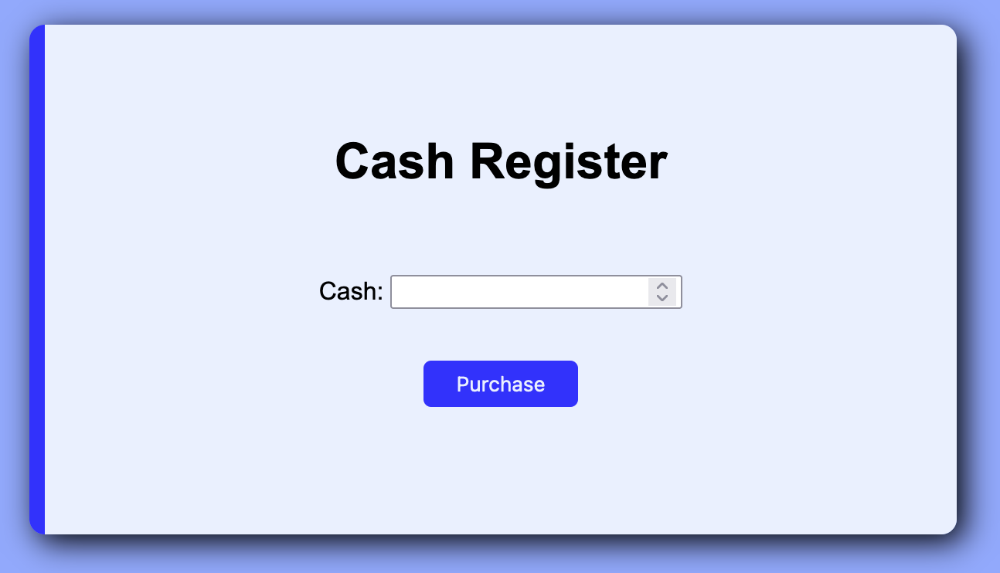

### Cash Register

> Here you'll build a cash register app that will return change to the customer based on the price of the item, the amount of cash provided by the customer, and the amount of cash in the cash drawer. You'll also need to show different messages to the user in different scenarios, such as when the customer provides too little cash or when the cash drawer doesn't have enough to issue the correct change.

#### Using the Cash Register

#### freeCodeCamp Disclaimer

This project was completed as part of [freeCodeCamp.org](https://www.freecodecamp.org)'s _JavaScript Algorithms and Data Structures_ course. This was a Certification Project, meaning [freeCodeCamp](https://www.freecodecamp.org) provided specifications and limited guidance and I was expected to code to meet certain test cases. The code presented here is my own.
